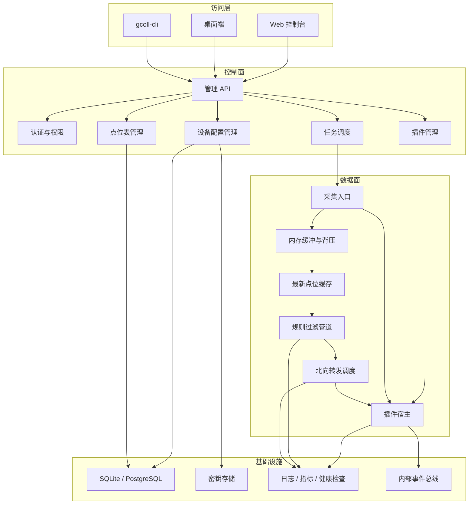

# gcoll

gcoll 是一个同时支持服务器部署和桌面端部署的数据采集平台。它面向工业现场、企业集成、边缘网关、本地调试和轻量运维场景，用于从设备、协议、文件、数据库、消息队列或业务系统采集数据，经本地或中心侧处理后转发到目标系统。

当前项目处于 MVP 设计与实现准备阶段。根目录 README 用于快速了解项目，当前有效设计以 `docs/current/` 为准。

## 项目定位

gcoll 使用同一套核心运行时支撑两种产品形态：

- 服务器部署：长期运行的集中式服务，提供采集调度、本地插件托管、管理 API、Web 控制台和应用商城扩展接口。
- 桌面端部署：通过 Wails 3 打包为桌面应用，用于本机部署、边缘采集、离线运行、现场调试和轻量运维。

系统的核心目标是建立插件化采集、处理、转发闭环。MVP 阶段优先验证本地插件模式、通用点位表、最新点位缓存、规则过滤和北向转发能力。

## 目标用户

- 运维工程师：配置采集任务、查看运行状态、处理告警和日志。
- 系统集成商：开发南向采集插件、北向转发插件和系统扩展插件。
- 企业管理员：管理用户权限、本地插件、设备、任务和应用商城源。
- 边缘部署工程师：在现场环境使用桌面端或轻量服务器完成本地采集和转发。

## 核心能力

- 同一套 Go 核心运行时支撑服务器端和桌面端。
- 插件分为系统插件、南向插件和北向插件。
- 插件默认独立进程运行，通过 gRPC 与宿主通信。
- 插件配置由宿主按设备维度保存、校验、审计，并加密敏感字段。
- 所有设备默认使用通用点位表。
- 采集明细不落库，只维护最新点位缓存。
- 数据按上报模式和规则过滤后再交给北向插件。
- 用户权限在 MVP 阶段简化为只读和可编辑。

## MVP 暂不包含

- 完整在线应用商城、评论评分、作者主页和社区能力。
- 多租户计费。
- 低代码可视化数据管道编排。
- 原生云市场集成。
- 采集历史数据存储和查询。
- 外部队列中间件。
- 第一个稳定版本发布前，对内部插件 API 做长期兼容承诺。

## 技术基线

| 层面 | 技术 |
| --- | --- |
| 后端 | Go + GoFrame |
| 桌面端 | Wails 3 |
| 前端 | Vue 3 + TypeScript + Vite + Naive UI |
| 状态管理 | Pinia |
| 路由 | Vue Router |
| 图表 | ECharts 或 uPlot |
| 插件通信 | gRPC + Protocol Buffers |
| 桌面默认数据库 | SQLite |
| 服务器生产数据库 | PostgreSQL |

## 总体架构



## 数据流

1. 南向插件从外部数据源采集原始数据。
2. 插件宿主接收批量采集记录并写入内存缓冲。
3. 运行时更新最新点位缓存。
4. 最新点位缓存按上报模式产生数据事件。
5. 规则过滤管道执行标准化、过滤和路由。
6. 北向转发调度调用北向插件。
7. 北向插件负责投递到目标系统。

北向目标系统的重试、幂等、确认和失败恢复由北向插件负责。高频采集路径不得逐条同步写库。

## 插件模型

插件包扩展名为 `.gcpkg`，本质是固定结构的 zip 包，包含 `plugin.yaml`、可执行文件、资源、文档、校验和与签名。

插件生命周期：

```text
Discovered
  -> Verified
  -> Installed
  -> Enabled
  -> Starting
  -> Running
  -> Stopping
  -> Stopped
  -> Disabled
  -> Uninstalled
```

插件通信只支持 gRPC + Protocol Buffers。插件协议与管理 API 独立版本化。

插件类型：

| 类型 | 职责 | 示例 |
| --- | --- | --- |
| 系统插件 | 扩展平台内部能力 | 认证扩展、授权策略、告警通道、诊断扩展 |
| 南向插件 | 从外部设备、协议、文件、数据库或 API 采集数据 | Modbus、OPC UA、MQTT 订阅、HTTP 轮询 |
| 北向插件 | 将过滤后的数据转发到目标系统 | HTTP 转发、MQTT 发布、数据库写入、文件导出 |

南向插件不得直接转发到最终目标系统。北向插件不得主动采集设备数据。插件不得直接访问宿主数据库。

## 点位与配置

- 所有设备默认使用通用点位表。
- 点位表描述采集点，不描述连接参数。
- 插件配置按设备独立保存，同一插件用于多个设备时，每个设备拥有独立配置、独立版本和独立审计记录。
- 敏感配置不得明文保存在普通配置 JSON 中，必须进入密钥存储并在配置中保存引用。
- 设备插件配置必须支持 `immediate` 和 `change` 两种上报模式，默认值为 `change`。

## 推荐仓库结构

```text
gcoll/
  cmd/
    gcoll-server/
      main.go
    gcoll-desktop/
    gcoll-cli/
  api/
    runtime/
      v1/
    openapi/
    proto/
  internal/
    boot/
    cmd/
    consts/
    controller/
      runtime/
    service/
      runtime/
      auth/
      device/
      point/
      pluginconfig/
      pluginmgmt/
      pluginhost/
      collector/
      runtimequeue/
      pointcache/
      pipeline/
      delivery/
      marketplace/
      scheduler/
      storage/
      secret/
      observability/
      eventbus/
  frontend/
    web/
    desktop/
  plugins/
    sdk-go/
    builtin/
    examples/
  deploy/
    docker/
    systemd/
  docs/
    current/
    ai/
    adr/
```

后端按 GoFrame 推荐三层组织：`api/<domain>/v1` 负责版本化契约，`internal/controller/<domain>` 负责 HTTP 适配，`internal/service/<domain>` 负责领域服务与业务编排。`cmd/<app>/main.go` 只保留入口，运行时装配放在 `internal/cmd`。

当前仓库尚未建立完整代码骨架。实现时应优先遵循 `docs/current/02-系统架构.md` 中的模块边界。

## 部署策略

- 桌面端：Wails 3 + SQLite + 本地插件目录。
- 服务器开发和轻量部署：可使用 SQLite。
- 服务器生产：PostgreSQL + Docker 或 systemd。
- MVP 优先单节点部署，后续再演进到中心服务器加边缘节点。

## 开发顺序

1. 建立 GoFrame 运行时骨架和配置加载。
2. 建立数据库迁移、日志、健康检查。
3. 建立插件清单、包校验和配置结构解析。
4. 建立设备、点位和设备插件配置模型。
5. 建立进程式插件宿主和 gRPC 握手。
6. 建立采集入口、内存缓冲、最新点位缓存。
7. 建立规则过滤和北向插件转发。
8. 实现南向 HTTP 轮询插件和北向 HTTP 转发插件。
9. 实现 Vue 控制台和 Wails 桌面端核心页面。

## 文档入口

开始任何需求、设计或实现前，先阅读：

1. `docs/README.md`
2. `docs/current/01-产品范围.md`
3. `docs/current/02-系统架构.md`
4. `docs/current/03-插件与点位协议.md`
5. `docs/current/04-前端设计规范.md`
6. `docs/current/05-开发任务规范.md`

需要让 AI 按项目方式持续开发时，优先阅读 `docs/ai/AI开发入口.md`。历史决策背景见 `docs/adr/`，但当前有效设计始终以 `docs/current/` 为准。

## 协作约束

- 文档和代码注释必须使用中文。
- 机器可读字段、命令、路径、API 路径、配置键和协议字段保持英文或约定格式。
- MVP 阶段内部契约按最新设计推进，不为尚未发布的旧内部设计添加兼容分支。
- 一旦插件协议、HTTP API、SDK、事件格式对第三方开发者公开，必须进行显式版本管理。
- 涉及外部公开契约的破坏性变更，实施前必须明确是否需要兼容策略。

## 第一个里程碑

第一个里程碑只验证完整闭环：

1. 启动 `gcoll-server`。
2. 本地安装一个南向 HTTP 轮询插件。
3. 本地安装一个北向 HTTP 转发插件。
4. 创建设备、点位和采集任务。
5. 采集样例数据并标准化。
6. 通过规则过滤后转发给北向插件。
7. 在前端查看运行状态和插件日志。
