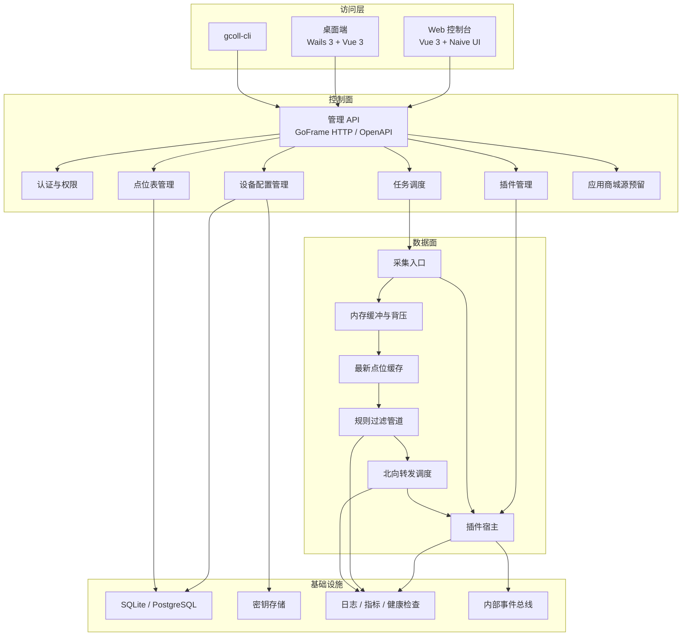
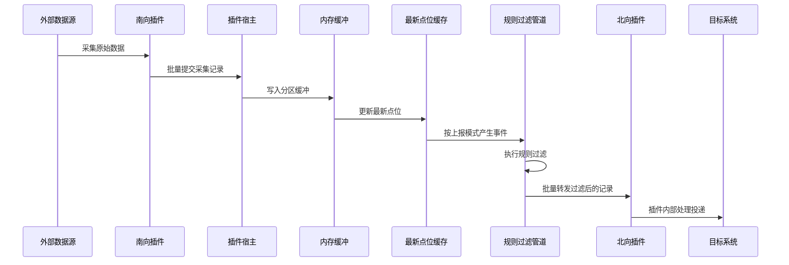

# 系统架构

## 架构原则

- 服务器端和桌面端共享核心运行时，不复制业务逻辑。
- 控制面和数据面分离，管理操作不得阻塞高频采集路径。
- 插件默认进程隔离，宿主负责生命周期、通信、健康检查和权限控制。
- 数据面以内存缓冲、最新点位缓存、规则过滤和背压为核心。
- 采集明细不落库，数据库只保存配置、任务、插件、用户、审计和必要运行状态。
- 内部契约在 MVP 阶段以最新设计为准；外部公开契约必须版本化。

## 总体架构



## 推荐仓库结构

```text
gcoll/
  cmd/
    gcoll-server/
      main.go
    gcoll-desktop/
    gcoll-cli/
  api/
    runtime/
      v1/
    openapi/
    proto/
  internal/
    boot/
    cmd/
    consts/
    controller/
      runtime/
    service/
      runtime/
      auth/
      device/
      point/
      pluginconfig/
      pluginmgmt/
      pluginhost/
      collector/
      runtimequeue/
      pointcache/
      pipeline/
      delivery/
      marketplace/
      scheduler/
      storage/
      secret/
      observability/
      eventbus/
  frontend/
    web/
    desktop/
  plugins/
    sdk-go/
    builtin/
    examples/
  deploy/
    docker/
    systemd/
  docs/
    current/
    ai/
    adr/
```

## GoFrame 后端分层规范

- `cmd/<app>/main.go` 只保留进程入口，负责把启动权交给 `internal/cmd`。
- `internal/cmd` 负责组装 GoFrame Server、初始化基础设施、注册中间件和路由，不承载业务规则。
- `api/<domain>/v1` 负责版本化请求与响应结构，是 HTTP/OpenAPI 的契约层。
- `internal/controller/<domain>` 负责处理 HTTP 入参、上下文和响应编排，只调用服务，不直接承载业务判断。
- `internal/service/<domain>` 负责领域服务和模块编排。MVP 阶段直接在 `service` 中实现，不额外引入 `logic/` 兼容层。
- HTTP 路由优先使用 GoFrame 标准路由，也就是 `Req/Res + g.Meta + group.Bind(...)` 组合；统一返回格式通过组级中间件处理。
- `internal/dao`、`internal/model/do`、`internal/model/entity` 在引入数据库表后由 GoFrame CLI 生成，不手工维护生成代码。

## 模块边界

| 模块 | 所属层面 | 职责 | 不应承担 |
| --- | --- | --- | --- |
| `internal/cmd` | 控制面 | 运行时装配、路由注册、中间件挂载 | 领域业务规则、数据面处理 |
| `api/<domain>/v1` | 控制面 | 版本化请求和响应契约 | 业务编排、数据库访问 |
| `internal/controller/<domain>` | 控制面 | HTTP 入口适配、鉴权上下文透传、响应输出 | 复杂业务规则、跨模块数据处理 |
| `internal/service/auth` | 控制面 | 用户、APIKey、只读和可编辑权限 | 数据面流程 |
| `internal/service/device` | 控制面 | 设备档案、设备状态汇总 | 点位值缓存 |
| `internal/service/point` | 控制面 | 通用点位表、导入导出、插件自带点位入口 | 设备连接参数 |
| `internal/service/pluginconfig` | 控制面 | 配置结构、设备配置、校验、版本、审计 | 采集循环 |
| `internal/service/pluginmgmt` | 控制面 | 插件包、安装、启停、升级、回滚 | 数据管道内部队列 |
| `internal/service/pluginhost` | 数据面 | 插件进程、握手、gRPC 调用、健康检查 | 业务配置持久化 |
| `internal/service/collector` | 数据面 | 采集任务、南向记录入口 | 北向转发 |
| `internal/service/runtimequeue` | 数据面 | 分区缓冲、背压、批量 | 复杂业务规则 |
| `internal/service/pointcache` | 数据面 | 最新点位缓存、变化检测 | 历史数据查询 |
| `internal/service/pipeline` | 数据面 | 标准化、规则过滤、路由 | 插件生命周期 |
| `internal/service/delivery` | 数据面 | 调用北向插件 | 目标系统投递语义 |
| `internal/service/storage` | 基础设施 | 数据访问、迁移、事务 | 业务规则 |
| `internal/service/observability` | 基础设施 | 结构化日志、指标、健康检查 | 反向控制业务流程 |

## 数据流



## 性能约束

- 南向插件优先批量提交记录，默认批量大小由压测决定。
- 数据面使用固定工作池，不无限制创建 goroutine。
- 高频路径不得逐条同步写库。
- 指标和运行状态异步聚合。
- 背压状态必须能传递给南向插件。
- 北向目标系统的重试、幂等、确认和失败恢复由北向插件负责。

## 数据库策略

推荐核心表：

- `users`
- `api_keys`
- `plugins`
- `plugin_versions`
- `plugin_config_schemas`
- `plugin_device_configs`
- `plugin_device_config_versions`
- `devices`
- `device_points`
- `device_point_versions`
- `collection_tasks`
- `pipeline_rules`
- `forward_targets`
- `runtime_events`
- `audit_logs`

敏感配置不得明文保存在普通配置 JSON 中，必须进入密钥存储并在配置中保存引用。

## API 策略

管理 API 使用 HTTP + OpenAPI，插件协议独立使用 gRPC。二者独立版本化。

管理 API 默认采用统一响应包裹结构：

```json
{
  "code": 0,
  "message": "OK",
  "data": {}
}
```

建议 API 分组：

- `/api/v1/auth`
- `/api/v1/runtime`
- `/api/v1/plugins`
- `/api/v1/plugin-configs`
- `/api/v1/devices`
- `/api/v1/devices/{deviceId}/points`
- `/api/v1/tasks`
- `/api/v1/pipeline`
- `/api/v1/targets`
- `/api/v1/logs`

桌面端本地 HTTP API 默认可开启，但必须使用 APIKey 授权。

## 部署策略

- 桌面端：Wails 3 + SQLite + 本地插件目录。
- 服务器开发和轻量部署：SQLite 可选。
- 服务器生产：PostgreSQL + Docker 或 systemd。
- MVP 优先单节点部署，后续再演进到中心服务器加边缘节点。

## 开发顺序

1. 建立 GoFrame 运行时骨架和配置加载。
2. 建立数据库迁移、日志、健康检查。
3. 建立插件清单、包校验和配置结构解析。
4. 建立设备、点位和设备插件配置模型。
5. 建立进程式插件宿主和 gRPC 握手。
6. 建立采集入口、内存缓冲、最新点位缓存。
7. 建立规则过滤和北向插件转发。
8. 实现南向 Modbus TCP 采集插件和北向 HTTP 转发插件。
9. 实现 Vue 控制台和 Wails 桌面端核心页面。
